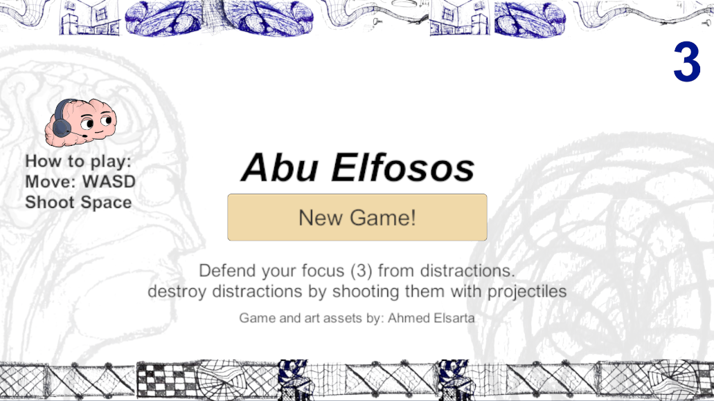
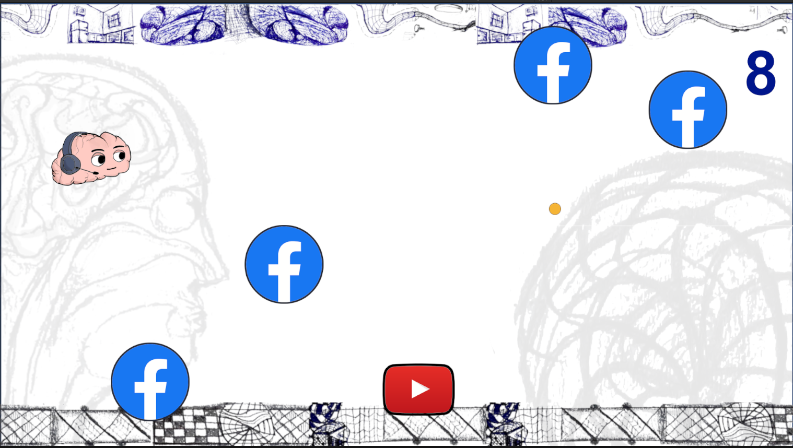

# Unity 2D shooter game made with my own assets.

<!-- split screen with 2 images -->

 

## How to play

### Web version

Just click [this link](https://simmer.io/@AhmedElsarta/brain-game) to play the webGL version in your browser.

### Unity version.

1. clone repository
2. Open the folder as a project from unity hub
3. Wait for unity to generate project files
4. Done
